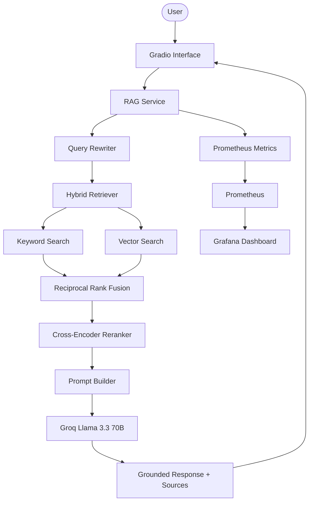
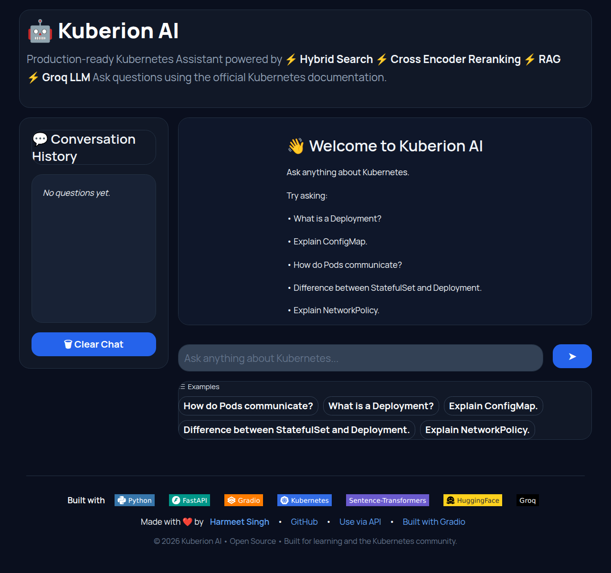
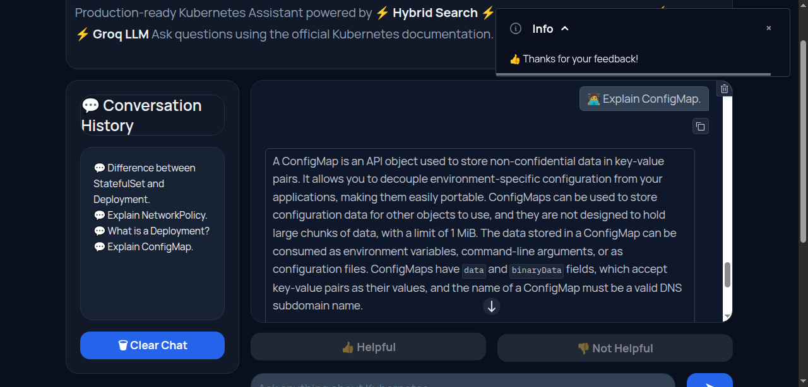
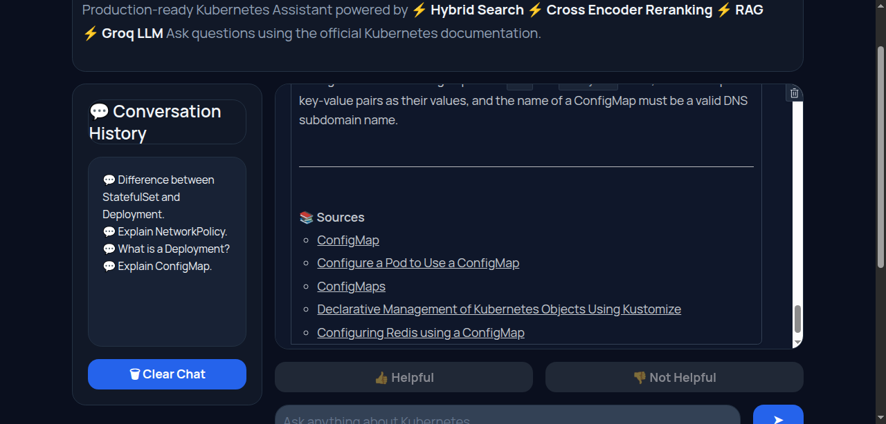
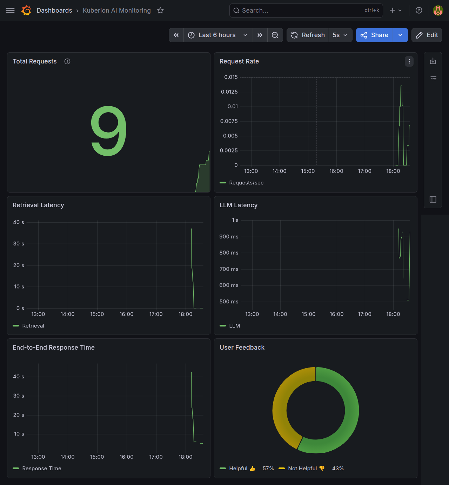
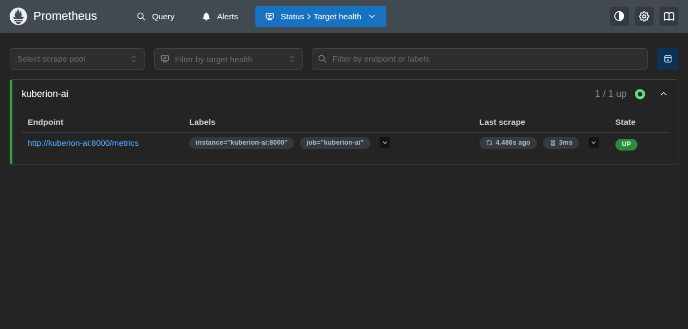
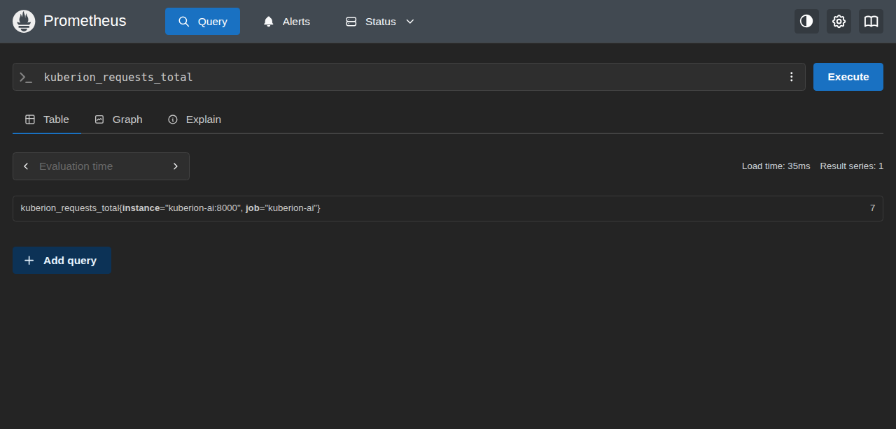
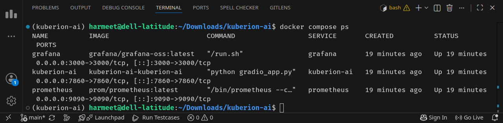

# Kuberion AI

**An end-to-end, production-ready Retrieval-Augmented Generation (RAG) system that delivers accurate, source-grounded answers from the official Kubernetes documentation.**


<p align="center">
  
  
  
  
  
  
  
  
</p>

---


# Table of Contents

- [Overview](#overview)
- [Features](#features)
- [Architecture](#architecture)
- [Design Decisions](#design-decisions)
- [Tech Stack](#tech-stack)
- [Dataset](#dataset)
- [Project Structure](#project-structure)
- [Installation](#installation)
- [Environment Variables](#environment-variables)
- [Running the Project](#running-the-project)
- [Ingestion Pipeline](#ingestion-pipeline)
- [Retrieval Pipeline](#retrieval-pipeline)
- [Evaluation](#eval)
- [Gradio Interface](#gradio-interface)
- [Docker](#docker)
- [Kestra Workflow](#kestra-workflow)
- [Monitoring](#monitor)
- [Screenshots](#screenshots)
- [Future Improvements](#future-improvements)
- [Acknowledgements](#acknowledgements)
- [License](#license)

## Overview

Kuberion AI is a Retrieval-Augmented Generation (RAG) assistant built for answering Kubernetes-related questions using the official Kubernetes documentation as its knowledge base. Instead of relying solely on a large language model, the application retrieves relevant documentation, re-ranks the retrieved passages, and grounds every response in authoritative Kubernetes content before generating an answer.

The project demonstrates a complete end-to-end RAG system with an emphasis on modular software design, reproducibility, evaluation, and production-oriented engineering practices. It includes an automated document ingestion pipeline, hybrid retrieval combining keyword and semantic search, reciprocal rank fusion (RRF), cross-encoder reranking, configurable query rewriting, prompt evaluation, monitoring with Prometheus and Grafana, containerized deployment using Docker Compose, and workflow orchestration with Kestra.

The knowledge base is constructed from the official Kubernetes documentation through an automated ingestion pipeline that discovers documents, cleans Markdown content, generates deterministic document chunks, and builds reusable embeddings. Hybrid retrieval combines lexical and semantic search to maximize recall, while a Cross-Encoder reranks the retrieved candidates before they are passed to the language model for response generation.

The application is organized into independent modules for ingestion, indexing, retrieval, prompting, evaluation, monitoring, and user interaction. A dedicated service layer exposes the RAG pipeline to the Gradio interface while keeping retrieval components reusable for future APIs or additional clients.

Unlike a conventional chatbot, Kuberion AI grounds every response in retrieved Kubernetes documentation and displays the corresponding source references, enabling users to verify the information used to generate each answer. Runtime metrics and user feedback are exported to Prometheus and visualized through Grafana dashboards to provide operational insights into application usage and performance.

## Features

### Retrieval-Augmented Generation (RAG)

- Answers Kubernetes questions using the official Kubernetes documentation
- Grounds every response using retrieved documentation instead of relying solely on the LLM
- Displays source links for every generated answer

### Hybrid Retrieval

- Keyword search
- Dense vector search using Sentence Transformers
- Reciprocal Rank Fusion (RRF) to combine retrieval results
- Duplicate removal before reranking

### Query Rewriting

- Rule-based query rewriting for Kubernetes terminology normalization
- Optional LLM-based query rewriting implementation
- Expands abbreviations such as `k8s`, `svc`, `lb`, and storage-related terms

### Cross-Encoder Reranking

- Re-ranks retrieved documents using a CrossEncoder model
- Improves document relevance before prompt generation
- Returns only the highest-quality context to the LLM

### Prompt Engineering

Multiple prompts are implemented and evaluated:

- Baseline Prompt
- Standard RAG Prompt
- Improved RAG Prompt

The best-performing prompt is selected based on automated evaluation.

### Automated Knowledge Base Construction

The ingestion pipeline performs:

- document discovery
- markdown parsing
- content cleaning
- fixed-size chunking
- deterministic chunk ID generation
- embedding generation
- processed dataset creation

### Monitoring

Application metrics are exported using Prometheus, including:

- Total requests
- Request latency
- Retrieval latency
- LLM latency
- Positive user feedback
- Negative user feedback

Grafana dashboards visualize these metrics for runtime monitoring.

### User Feedback Collection

Users can provide:

- 👍 Helpful
- 👎 Not Helpful

Feedback is exported as Prometheus metrics and displayed in Grafana dashboards.

### Containerized Deployment

The complete application stack is containerized using Docker Compose, including:

- Kuberion AI
- Prometheus
- Grafana

### Workflow Orchestration

Kestra is included to automate knowledge base generation, allowing embeddings and indexes to be rebuilt whenever the documentation changes.

Pre-generated embeddings are committed to the repository so reviewers can run the application immediately without waiting for embedding generation.

### Evaluation

The project includes automated evaluation for:

- Retrieval strategies
- Prompt quality
- Query rewriting
- LLM response quality

Evaluation results are stored under the `evaluation/results` directory.

### User Interface

A modern Gradio interface provides:

- conversational chat interface
- source citations
- conversation history
- example questions
- copy response button
- user feedback buttons

## Architecture

Kuberion AI follows a modular Retrieval-Augmented Generation (RAG) architecture that separates document ingestion, retrieval, response generation, monitoring, and user interaction into independent components. This modular design improves maintainability, simplifies testing, and allows individual components to be replaced or extended without affecting the rest of the system.

At runtime, user questions are submitted through the Gradio interface and handled by a shared service layer. The service invokes the RAG pipeline, which performs query rewriting, hybrid retrieval, cross-encoder reranking, prompt construction, and response generation using Groq's hosted Llama 3.3 model. The generated answer, together with the supporting document sources, is returned to the user interface.

The retrieval system combines keyword search and semantic vector search using Reciprocal Rank Fusion (RRF). Retrieved candidates are re-ranked using a Cross-Encoder model before being inserted into the final prompt, ensuring that the language model receives the most relevant context. Runtime metrics and user feedback are exported to Prometheus and visualized through Grafana dashboards for monitoring.

### System Architecture



### Component Responsibilities

| Component | Responsibility |
|-----------|----------------|
| **Gradio Interface** | Accepts user questions, displays answers, sources, conversation history, and collects user feedback. |
| **Service Layer** | Provides a single entry point to the RAG pipeline and separates the user interface from retrieval logic. |
| **Query Rewriter** | Normalizes Kubernetes terminology using rule-based rewriting by default, with optional LLM-based rewriting available. |
| **Hybrid Retriever** | Executes keyword search and semantic vector search in parallel before combining results using Reciprocal Rank Fusion (RRF). |
| **Cross-Encoder Reranker** | Reorders retrieved documents according to semantic relevance and selects the highest-quality context for generation. |
| **Prompt Builder** | Formats retrieved documents into a structured prompt together with the user's original question. |
| **Groq LLM** | Generates grounded answers using the retrieved Kubernetes documentation as context. |
| **Monitoring** | Exports request counts, latency metrics, and user feedback to Prometheus for visualization in Grafana. |

## Design Decisions

This project intentionally favors modularity, reproducibility, and ease of evaluation over unnecessary complexity. Each major component was selected to improve retrieval quality, simplify maintenance, or make the project easier for reviewers and contributors to reproduce.

### Hybrid Retrieval

Rather than relying on a single retrieval strategy, the system combines keyword search and dense vector search.

- **Keyword search** performs well when queries contain exact Kubernetes terminology, resource names, or configuration fields.
- **Semantic vector search** retrieves conceptually similar documents even when different wording is used.

The outputs of both retrieval methods are combined using **Reciprocal Rank Fusion (RRF)**, which improves recall by leveraging the strengths of both approaches.

### Cross-Encoder Reranking

Initial retrieval returns a broad set of candidate documents. A Cross-Encoder reranker then scores each query-document pair and reorders the results according to semantic relevance.

Only the highest-ranked documents are included in the final prompt. This reduces irrelevant context and improves the quality of generated responses.

### Rule-Based Query Rewriting

The default query rewriting strategy is rule-based rather than LLM-based.

This decision was made because rule-based rewriting:

- executes instantly,
- requires no additional API calls,
- incurs no extra inference cost,
- produces deterministic results, and
- expands common Kubernetes abbreviations such as `k8s`, `svc`, and `lb`.

An optional LLM-based rewriting strategy is also implemented for experimentation and comparison.

### Prompt-Based RAG

Instead of embedding large amounts of metadata into prompts, the system constructs prompts dynamically using only the highest-ranked retrieved documents.

Each prompt includes:

- the user's original question,
- retrieved document titles,
- section names,
- document content, and
- official Kubernetes source URLs.

This keeps responses grounded in retrieved evidence while maintaining concise prompts.

### Pre-generated Knowledge Base

Document embeddings are generated once during ingestion and committed to the repository.

This allows reviewers to clone the project and immediately run the application without waiting for embedding generation, significantly reducing setup time. The complete ingestion workflow remains available through Kestra for rebuilding the knowledge base whenever the source documentation changes.

### Modular Project Structure

The project separates responsibilities into dedicated modules, including:

- ingestion,
- retrieval,
- prompting,
- service layer,
- evaluation,
- monitoring,
- user interface, and
- workflow automation.

This separation improves readability, simplifies testing, and makes individual components easier to replace or extend.

### Built-in Monitoring

Observability is treated as a first-class component rather than an afterthought.

Application metrics, request latency, retrieval latency, LLM latency, and user feedback are exported through Prometheus and visualized in Grafana dashboards. This provides operational insight into system performance and user interactions during demonstrations and evaluation.

## Tech Stack

The project is implemented entirely in Python and follows a modular architecture where each component has a well-defined responsibility.

| Category | Technology | Purpose |
|----------|------------|---------|
| **Programming Language** | Python 3.12 | Core application development |
| **Package Management** | uv | Dependency management and reproducible environments |
| **User Interface** | Gradio | Interactive web-based chat interface |
| **API Framework** | FastAPI | Backend API support and future extensibility |
| **Large Language Model** | Groq API (Llama 3.3 70B Versatile) | Response generation |
| **Embedding Model** | Sentence Transformers | Dense document embeddings for semantic retrieval |
| **Keyword Retrieval** | MinSearch | Lexical search over document chunks |
| **Hybrid Retrieval** | Reciprocal Rank Fusion (RRF) | Combines keyword and semantic search results |
| **Document Reranking** | Sentence Transformers Cross-Encoder | Semantic reranking of retrieved documents |
| **Document Parsing** | Python Frontmatter, Markdown, BeautifulSoup4 | Processing Kubernetes Markdown documentation |
| **Configuration** | python-dotenv | Environment variable management |
| **Monitoring** | Prometheus | Metrics collection |
| **Visualization** | Grafana | Monitoring dashboards |
| **Workflow Orchestration** | Kestra | Automated knowledge base generation |
| **Containerization** | Docker & Docker Compose | Reproducible deployment |
| **Data Format** | JSON | Processed document storage |
| **Version Control** | Git & GitHub | Source code management |

### Core Python Libraries

The project uses the following primary Python packages:

- **Gradio** for the conversational web interface.
- **FastAPI** for API support.
- **Groq SDK** for communicating with the hosted Llama 3.3 language model.
- **Sentence Transformers** for embedding generation and Cross-Encoder reranking.
- **MinSearch** for keyword-based retrieval.
- **BeautifulSoup4** and **Markdown** for parsing and cleaning Kubernetes documentation.
- **Prometheus Client** for exporting application metrics.
- **python-dotenv** for environment configuration.
- **PyYAML** for workflow and configuration files.
- **Requests** for downloading the source documentation during ingestion.
  
## Dataset

Kuberion AI uses the **official Kubernetes documentation** as its knowledge base. All answers generated by the application are grounded in this documentation, ensuring that responses are based on authoritative and up-to-date Kubernetes concepts rather than relying solely on the language model's internal knowledge.

### Source

The documentation is downloaded from the official Kubernetes website repository:

- **Repository:** https://github.com/kubernetes/website
- **Branch:** `main`

During ingestion, the system recursively scans the following directory:

```text
content/en/docs/
```

Only Markdown documentation files (`.md` and `.mdx`) are included in the knowledge base.

### Why This Dataset?

The Kubernetes documentation was selected because it is:

- maintained by the Kubernetes project,
- continuously updated by the community,
- comprehensive across Kubernetes concepts,
- well-structured for document chunking, and
- publicly available under an open-source license.

Using the official documentation allows generated responses to remain grounded in trusted technical content while providing users with direct links to the original documentation.

### Dataset Processing

The raw documentation is transformed into a searchable knowledge base through the ingestion pipeline.

The pipeline performs the following steps:

1. Discover all supported Markdown documentation files.
2. Parse Markdown content and metadata.
3. Clean and normalize document text.
4. Split documents into overlapping chunks.
5. Generate deterministic chunk identifiers.
6. Build document embeddings.
7. Store processed documents and embeddings for retrieval.

The processed artifacts are stored under:

```text
data/
├── raw/
├── processed/
├── embeddings/
└── indexes/
```

### Chunking Strategy

Documents are divided into overlapping text chunks before indexing.

| Parameter | Value |
|-----------|------:|
| Chunk Size | 500 words |
| Chunk Overlap | 100 words |

Overlapping chunks help preserve contextual continuity across document boundaries while improving retrieval quality.

### Embedding Model

Dense vector representations are generated using:

**BAAI/bge-small-en-v1.5**

The generated embeddings have a dimensionality of **384** and are stored locally for semantic retrieval.

To improve reproducibility and reduce setup time, the generated embeddings are included in the repository. Reviewers can therefore run the application immediately without waiting for embedding generation, while the complete ingestion workflow remains available through Kestra whenever the knowledge base needs to be rebuilt.

## Project Structure

The project is organized into modular components that separate ingestion, retrieval, user interaction, evaluation, monitoring, and deployment. Each directory has a single responsibility, making the codebase easier to understand, maintain, and extend.

```text
kuberion-ai/
├── app/                # Service layer, API models, dependency container, LLM client
├── data/               # Raw documents, processed chunks, embeddings, indexes
├── docs/               # Architecture, design notes, evaluation reports
├── evaluation/         # Retrieval, prompt and query rewriting evaluation
├── ingestion/          # Dataset extraction, parsing, cleaning and chunking
├── kestra/             # Workflow for automated knowledge base generation
├── monitoring/         # Prometheus metrics
├── prompts/            # Prompt templates
├── retrieval/          # Retrieval, reranking, query rewriting and RAG pipeline
├── scripts/            # Utility scripts for building the knowledge base
├── tests/              # Unit tests
├── ui/                 
├── Dockerfile
├── docker-compose.yml
├── prometheus.yml
├── gradio_app.py
├── config.py
└── README.md
```

### Directory Overview

| Directory | Purpose |
|-----------|---------|
| **app/** | Implements the application service layer, dependency container, response models, and Groq LLM client. |
| **data/** | Stores the complete knowledge base, including raw Kubernetes documentation, processed document chunks, generated embeddings, and indexes. |
| **docs/** | Contains architecture diagrams, design documentation, and evaluation artifacts referenced throughout the project. |
| **evaluation/** | Scripts and datasets used to evaluate retrieval quality, prompt performance, and query rewriting strategies. |
| **ingestion/** | Implements the end-to-end knowledge base construction pipeline, including document discovery, parsing, cleaning, chunking, and preprocessing. |
| **kestra/** | Defines the workflow that automates rebuilding the knowledge base from the original documentation. |
| **monitoring/** | Exposes Prometheus metrics collected from the application. |
| **prompts/** | Contains prompt templates evaluated during experimentation. |
| **retrieval/** | Implements hybrid retrieval, Reciprocal Rank Fusion (RRF), query rewriting, reranking, embedding generation, and the RAG pipeline. |
| **scripts/** | Utility scripts for rebuilding the knowledge base outside the application runtime. |
| **tests/** | Unit tests covering retrieval, reranking, prompt generation, embeddings, and the service layer. |

## Installation

### Prerequisites

Before running Kuberion AI, ensure the following software is installed:

| Requirement | Version |
|------------|----------|
| Python | 3.12 or later |
| Git | Latest |
| Docker | Latest |
| Docker Compose | Latest |
| uv | Latest |

The project uses **uv** for dependency management to provide fast and reproducible Python environments.

---

### Clone the Repository

```bash
git clone https://github.com/harmeetsingh11/kuberion-ai.git

cd kuberion-ai
```

---

### Create a Virtual Environment

Create and activate a virtual environment.

Linux / macOS

```bash
python3 -m venv .venv

source .venv/bin/activate
```

Windows

```powershell
python -m venv .venv

.venv\Scripts\activate
```

---

### Install Dependencies

Install all required packages using **uv**.

```bash
uv sync
```

If **uv** is not installed:

```bash
pip install uv
```

---

### Configure Environment Variables

Create a `.env` file in the project root.

```text
GROQ_API_KEY=your_groq_api_key
```

A Groq API key is required for answer generation. The application uses the **Llama 3.3 70B Versatile** model through the Groq API.

---

### Knowledge Base

The repository already contains the processed Kubernetes knowledge base and generated embeddings.

Therefore, **you do not need to regenerate embeddings before running the application.**

This significantly reduces setup time for reviewers.

If you wish to rebuild the knowledge base using the latest Kubernetes documentation, refer to the **Kestra Workflow** section.

---

### Verify Installation

Run the following command to ensure all dependencies are installed successfully.

```bash
uv run python --version
```

or

```bash
uv run pytest
```

If the installation completes successfully without errors, the project is ready to run.

## Environment Variables

Kuberion AI uses environment variables to keep sensitive configuration separate from the source code.

Create a `.env` file in the project root directory.

```text
GROQ_API_KEY=your_groq_api_key
```

### Variable Description

| Variable | Required | Description |
|----------|:--------:|-------------|
| `GROQ_API_KEY` | ✅ | API key used to access the Groq API for Llama 3.3 70B Versatile. |

### Obtaining a Groq API Key

1. Create an account at **https://console.groq.com**.
2. Generate a new API key.
3. Copy the key into the `.env` file.

> **Note**
>
> The `.env` file is intentionally excluded from version control and should never be committed to Git.

## Running the Project

Kuberion AI can be run either locally using Python or as a fully containerized application using Docker Compose.

### Option 1 — Run Locally

Start the Gradio application.

```bash
uv run python gradio_app.py
```

The application will be available at:

```text
http://localhost:7860
```

Prometheus metrics are automatically exposed at:

```text
http://localhost:8000/metrics
```

---

### Option 2 — Run with Docker Compose (Recommended)

Build and start all services.

```bash
docker compose up --build
```

Or run the services in the background.

```bash
docker compose up -d --build
```

Docker Compose automatically starts:

- Kuberion AI
- Prometheus
- Grafana

No additional configuration is required.

---

### Available Services

| Service | URL | Description |
|----------|-----|-------------|
| **Kuberion AI** | http://localhost:7860 | Gradio chat interface |
| **Prometheus** | http://localhost:9090 | Metrics collection and querying |
| **Grafana** | http://localhost:3000 | Monitoring dashboards |

---

### Grafana Login

Default credentials:

```text
Username: admin
Password: admin
```

Grafana prompts for a new password on the first login.

---

### Stopping the Application

If running locally, stop the application with:

```text
Ctrl + C
```

If running with Docker Compose:

```bash
docker compose down
```

To remove unused Docker resources:

```bash
docker system prune
```

---

### Notes

- The repository already includes the generated embeddings and processed knowledge base.
- Reviewers can run the application immediately after configuring the Groq API key.
- Rebuilding the knowledge base is optional and described in the **Kestra Workflow** section.

## Ingestion Pipeline

The ingestion pipeline is responsible for transforming the official Kubernetes documentation into a searchable knowledge base that can be used during retrieval.

Rather than querying raw Markdown files directly, the pipeline performs a series of preprocessing steps to normalize the documentation, generate document chunks, compute embeddings, and prepare the artifacts required by the retrieval system.

The complete workflow can be executed manually or automatically using the Kestra workflow.

### Pipeline Stages

The ingestion process consists of the following stages:

```text
Official Kubernetes Documentation
                │
                ▼
      Clone Repository
                │
                ▼
     Discover Markdown Files
                │
                ▼
       Parse Documentation
                │
                ▼
        Clean Markdown Text
                │
                ▼
       Split into Chunks
                │
                ▼
 Generate Deterministic IDs
                │
                ▼
 Save Processed Documents
                │
                ▼
 Generate Dense Embeddings
                │
                ▼
 Knowledge Base Ready
```

### 1. Repository Download

The pipeline downloads the official Kubernetes documentation repository and stores it under:

```text
data/raw/kubernetes-docs/
```

The `main` branch of the Kubernetes documentation repository is used as the source of truth.

---

### 2. Document Discovery

The `DocumentExtractor` recursively scans the repository and discovers every supported documentation file.

Supported file formats:

- `.md`
- `.mdx`

Only files located inside:

```text
content/en/docs/
```

are included in the knowledge base.

---

### 3. Markdown Parsing

Each discovered document is parsed using the custom Markdown parser.

During parsing, the pipeline extracts:

- title
- section
- document content
- metadata
- source path

This produces a structured internal document representation that is independent of the original Markdown format.

---

### 4. Document Cleaning

The parser output is passed through a cleaning stage that removes unnecessary formatting while preserving the technical content.

The cleaning process normalizes the documentation before chunk generation, resulting in more consistent retrieval quality.

---

### 5. Document Chunking

Large documentation pages are divided into overlapping chunks.

Current configuration:

| Parameter | Value |
|-----------|------:|
| Chunk Size | 500 words |
| Chunk Overlap | 100 words |

Overlapping chunks help preserve contextual continuity when information spans multiple sections of a document.

---

### 6. Deterministic Chunk IDs

Each chunk receives a deterministic identifier generated from:

- source document path
- chunk content

Using deterministic identifiers ensures that the same document always produces identical chunk IDs across ingestion runs, simplifying reproducibility and future updates.

---

### 7. Processed Knowledge Base

The processed chunks are stored as structured JSON documents.

```text
data/processed/documents.json
```

Each document contains:

- unique ID
- title
- section
- content
- source path
- Kubernetes documentation URL
- metadata

---

### 8. Embedding Generation

Semantic embeddings are generated for every processed document using the Sentence Transformers embedding model:

```text
BAAI/bge-small-en-v1.5
```

The resulting embeddings are stored in:

```text
data/embeddings/
```

including:

```text
embeddings.npy
documents.json
model.txt
```

To improve reproducibility, embedding generation is cached.

If the embeddings already exist, the pipeline reuses the cached artifacts instead of recomputing them.

---

### Automation with Kestra

The entire ingestion process can be executed automatically using the provided Kestra workflow.

The workflow performs the following steps:

1. Creates a Python execution environment.
2. Installs project dependencies.
3. Executes the knowledge base build script.
4. Generates processed documents and embeddings.

Because the generated embeddings are already included in the repository, reviewers can run the application immediately without rebuilding the knowledge base. Re-running the ingestion workflow is only necessary when updating the Kubernetes documentation or regenerating embeddings.

## Retrieval Pipeline

After the knowledge base has been built, Kuberion AI answers user questions using a multi-stage Retrieval-Augmented Generation (RAG) pipeline. Rather than sending the user's question directly to the language model, the system first retrieves relevant Kubernetes documentation, filters and reranks the results, constructs a grounded prompt, and finally generates an answer using the retrieved evidence.

This architecture reduces hallucinations while improving answer quality and traceability.

### Retrieval Workflow

```text
User Question
      │
      ▼
Query Rewriting
      │
      ▼
Hybrid Retrieval
(Keyword + Vector Search)
      │
      ▼
Reciprocal Rank Fusion (RRF)
      │
      ▼
Duplicate Removal
      │
      ▼
Cross-Encoder Reranking
      │
      ▼
Top 5 Documents
      │
      ▼
Prompt Builder
      │
      ▼
Groq Llama 3.3 70B
      │
      ▼
Grounded Response
      │
      ▼
Gradio Interface
```

---

### 1. Query Rewriting

Before retrieval begins, the user's query is normalized to improve retrieval quality.

The project supports two query rewriting strategies.

#### Rule-Based Query Rewriting (Default)

The default implementation performs lightweight preprocessing by:

- converting text to lowercase,
- removing punctuation,
- expanding common Kubernetes abbreviations,
- replacing informal terminology with Kubernetes-specific vocabulary.

Examples include:

| Original | Rewritten |
|----------|------------|
| `k8s` | `kubernetes` |
| `svc` | `service` |
| `lb` | `load balancer` |
| `config` | `configuration` |
| `volumes` | `persistent volumes` |

This approach requires no additional LLM call, introduces virtually no latency, and avoids additional API costs.

#### LLM-Based Query Rewriting (Optional)

The project also includes an alternative LLM-powered query rewriting strategy.

When enabled, the language model rewrites the user's question into terminology that better matches the Kubernetes documentation while preserving the original intent.

Although this can improve retrieval for ambiguous queries, it introduces an additional LLM request. Therefore, the rule-based approach is used by default for the main application.

---

### 2. Hybrid Retrieval

Kuberion AI combines two complementary retrieval methods.

#### Keyword Search

Keyword retrieval uses **MinSearch** to locate documents containing important lexical matches.

This approach performs well for:

- API names
- resource names
- Kubernetes terminology
- exact technical phrases

#### Vector Search

Semantic retrieval searches the embedding space generated by the Sentence Transformer model.

This enables retrieval even when the user does not use the exact wording found in the documentation.

---

### 3. Reciprocal Rank Fusion (RRF)

Instead of choosing either keyword search or vector search, both result sets are combined using **Reciprocal Rank Fusion (RRF)**.

RRF assigns higher scores to documents that consistently rank well across both retrieval strategies.

This provides a more balanced ranking than relying on either retrieval method independently and was selected based on the retrieval evaluation performed during development.

---

### 4. Duplicate Removal

Because the same document may appear in both retrieval results, duplicate entries are removed before reranking.

Documents are deduplicated using their Kubernetes documentation URL, ensuring that each source appears only once in the final candidate set.

---

### 5. Cross-Encoder Reranking

The merged candidate documents are reranked using the Cross-Encoder model:

```text
cross-encoder/ms-marco-MiniLM-L-6-v2
```

Unlike embedding similarity, the Cross-Encoder jointly evaluates the user query and each candidate document, producing a more accurate relevance score.

After reranking, only the **top five** documents are retained for prompt construction.

This stage significantly improves retrieval precision by promoting the most relevant documentation passages.

---

### 6. Prompt Construction

The selected documents are passed to the `PromptBuilder`.

For every retrieved document, the generated prompt includes:

- document title,
- documentation section,
- document content,
- official Kubernetes documentation URL.

These retrieved passages form the context supplied to the language model.

---

### 7. Response Generation

The grounded prompt is sent to:

```text
Groq
Model: Llama-3.3-70B-Versatile
Temperature: 0
```

Using a deterministic temperature improves reproducibility and produces consistent responses for identical queries.

Because the language model receives only the retrieved Kubernetes documentation as context, generated answers remain grounded in the knowledge base instead of relying solely on the model's internal knowledge.

---

### 8. Source Attribution

Every response includes links to the original Kubernetes documentation used during generation.

Displaying source references allows users to:

- verify generated answers,
- consult the official documentation,
- improve transparency,
- increase trust in the generated responses.

---

### 9. Performance Monitoring

The retrieval pipeline is instrumented with Prometheus metrics.

The application records:

- total user requests,
- retrieval latency,
- LLM latency,
- end-to-end request latency,
- positive user feedback,
- negative user feedback.

These metrics are visualized in Grafana dashboards to monitor application performance and user interactions.

<a id="eval"></a>
## Evaluation

The retrieval and generation components were evaluated independently before being integrated into the final Retrieval-Augmented Generation (RAG) pipeline. The objective of the evaluation was to identify the best-performing retrieval strategy, prompt template, and query preprocessing approach while ensuring the system remained reproducible and easy to extend.

Dedicated evaluation scripts are provided for each major component, enabling experiments to be performed independently without affecting the production pipeline.

### Evaluation Components

| Evaluation | Script |
|------------|--------|
| Retrieval Strategies | `evaluation/evaluate_retrieval.py` |
| Prompt Comparison | `evaluation/evaluate_prompts.py` |
| Query Rewriting | `evaluation/evaluate_query_rewriting.py` |
| LLM Response Evaluation | `evaluation/evaluate_llm.py` |

Evaluation datasets and experiment results are stored under:

```text
evaluation/
├── questions.json
├── prompt_questions.json
├── llm_questions.json
└── results/
```

---

## Retrieval Evaluation

Four retrieval configurations were evaluated using the same set of Kubernetes questions to identify the most effective retrieval strategy.

| Retrieval Method | Accuracy |
|------------------|---------:|
| Keyword Search | 72.0% |
| Vector Search | 72.0% |
| Hybrid Search (Keyword + Vector + Reciprocal Rank Fusion) | **90.0%** |
| Hybrid Search + Cross-Encoder Reranker | **90.0%** |

Hybrid Search significantly outperformed standalone keyword and vector retrieval by improving retrieval accuracy from **72%** to **90%**.

A Cross-Encoder reranker was subsequently applied to reorder the retrieved documents before answer generation. Although the evaluation accuracy remained unchanged on the benchmark dataset, reranking consistently produced a more relevant ordering of retrieved passages and therefore remains part of the production pipeline.

**Selected Retrieval Strategy:** Hybrid Search with Cross-Encoder Reranking.

---

## Prompt Evaluation

Three prompt templates were evaluated while keeping the retrieval pipeline and evaluation dataset unchanged.

| Prompt | Avg Latency (s) | Avg Words | Avg Sources | Hallucination Pass |
|--------|----------------:|----------:|------------:|-------------------:|
| `baseline_prompt.txt` | 11.58 | 78 | 5.0 | 9/10 |
| `rag_prompt.txt` | 12.99 | 78 | 5.0 | 10/10 |
| `improved_rag_prompt.txt` | **13.10** | 78 | 5.0 | **10/10** |

Each prompt was evaluated based on:

- Response latency
- Response length
- Number of retrieved source documents
- Hallucination resistance

Although the improved prompt introduced a slight increase in response latency, it consistently produced the most reliable grounded responses while maintaining complete source coverage. Consequently, **`improved_rag_prompt.txt`** was selected as the default prompt for the production system.

---

## Query Rewriting Evaluation

The project evaluates query preprocessing before document retrieval.

Two query rewriting strategies are implemented:

- Rule-Based Query Rewriting
- LLM-Based Query Rewriting

The production application uses the rule-based strategy because it:

- expands common Kubernetes abbreviations and terminology,
- requires no additional LLM inference,
- introduces negligible latency,
- avoids additional API cost.

The LLM-based implementation is included for experimentation and future comparison but is intentionally disabled in the production configuration.

---

## LLM Evaluation

The complete Retrieval-Augmented Generation pipeline was evaluated using a representative set of Kubernetes questions after retrieval, reranking, and prompt optimization had been completed.

The evaluation considered:

- factual grounding,
- response consistency,
- response latency,
- source utilization,
- handling of out-of-domain queries.

The selected production configuration achieved an **average response latency of 12.77 seconds** while consistently grounding responses using **five retrieved documentation sources**.

An additional out-of-domain evaluation was performed using the question **"What is AWS Lambda?"**. Instead of generating unsupported information, the system correctly identified that the topic falls outside the indexed Kubernetes knowledge base, demonstrating that the RAG pipeline effectively constrains responses to retrieved documentation and reduces hallucinations.

---

## Final Production Configuration

The following configuration was selected after completing the evaluation process.

| Component | Selected Configuration |
|-----------|------------------------|
| Knowledge Base | Official Kubernetes Documentation |
| Query Rewriting | Rule-Based Query Rewriting |
| Retrieval | Hybrid Search (Keyword + Vector + Reciprocal Rank Fusion) |
| Re-ranking | Cross-Encoder (`cross-encoder/ms-marco-MiniLM-L-6-v2`) |
| Prompt Template | `improved_rag_prompt.txt` |
| LLM | Groq Llama 3.3 70B Versatile |
| User Interface | Gradio |
| Monitoring | Prometheus + Grafana |

---

## Continuous Evaluation

The evaluation framework is fully modular, allowing new retrieval strategies, prompt templates, reranking models, embedding models, and query rewriting approaches to be evaluated independently before deployment.

This design supports reproducible experimentation and enables future improvements to be validated quantitatively before being incorporated into the production RAG pipeline.

## Gradio Interface

Kuberion AI provides an interactive web interface built with **Gradio**, enabling users to ask Kubernetes-related questions through a modern conversational experience.

The interface communicates directly with the RAG service layer and presents grounded responses together with references to the official Kubernetes documentation.

### Features

The interface includes the following capabilities:

- Interactive chatbot interface
- Real-time response generation
- Conversation history sidebar
- Source attribution for every answer
- One-click response copying
- Built-in example questions
- User feedback collection (👍 / 👎)
- Responsive layout
- Professional dark theme
- Automatic metrics collection for monitoring

---

### User Workflow

The interaction flow is designed to be straightforward.

```text
User Question
       │
       ▼
Gradio Interface
       │
       ▼
RAG Service
       │
       ▼
Hybrid Retrieval Pipeline
       │
       ▼
Groq LLM
       │
       ▼
Generated Answer
       │
       ▼
Official Documentation Sources
       │
       ▼
User Feedback (👍 / 👎)
       │
       ▼
Prometheus Metrics
```

---

### Conversation History

The application maintains a session-level conversation history that records previously submitted questions.

This allows users to quickly review earlier interactions without repeating queries during the same session.

---

### Source References

Every generated answer includes links to the corresponding Kubernetes documentation pages used during retrieval.

Providing source references allows users to:

- verify generated information,
- consult the original documentation,
- improve transparency,
- build trust in the generated responses.

---

### Built-in Example Questions

Several predefined example questions are included to help users explore the application immediately after launch.

Examples include:

- What is a Deployment?
- Explain ConfigMap.
- How do Pods communicate?
- Difference between StatefulSet and Deployment.
- Explain NetworkPolicy.

These examples demonstrate common Kubernetes concepts while allowing reviewers to test the retrieval pipeline quickly.

---

### User Feedback

After receiving a response, users can provide feedback using the built-in:

- 👍 Helpful
- 👎 Not Helpful

buttons.

Feedback is immediately exported as Prometheus metrics and visualized in the Grafana monitoring dashboard.

Collecting explicit user feedback enables basic quality monitoring and satisfies one of the monitoring requirements of the project.

---

### Responsive User Experience

The interface was designed with usability in mind and includes:

- responsive two-column layout,
- conversation history sidebar,
- large chat area,
- modern typography,
- automatic scrolling,
- example prompts,
- copy-to-clipboard support,
- clean dark theme.

The UI intentionally separates user interaction from the retrieval pipeline through the service layer, allowing future interfaces (such as FastAPI clients or mobile applications) to reuse the same backend without modification.

## Docker

Kuberion AI is fully containerized using **Docker** and **Docker Compose**, allowing the complete application stack to be deployed with a single command.

Containerization ensures a consistent runtime environment across development and evaluation while simplifying the setup process for reviewers.

### Containerized Services

The Docker Compose configuration starts the following services:

| Service | Purpose |
|----------|---------|
| **Kuberion AI** | Runs the Gradio application and exposes the Prometheus metrics endpoint. |
| **Prometheus** | Collects application metrics by scraping the `/metrics` endpoint. |
| **Grafana** | Visualizes Prometheus metrics through interactive dashboards. |

---

### Architecture

```text
                    Docker Compose
                           │
        ┌──────────────────┼──────────────────┐
        │                  │                  │
        ▼                  ▼                  ▼
   Kuberion AI        Prometheus         Grafana
        │                  │                  │
        │                  │                  │
        └────── /metrics ──┘                  │
                           │                  │
                           └──────────────────┘
                              Dashboard Views
```

---

### Running the Stack

Build and start all services.

```bash
docker compose up -d --build
```

Stop all services.

```bash
docker compose down
```

---

### Benefits of Containerization

Using Docker Compose provides several advantages:

- Consistent execution environment across operating systems.
- Simplified installation with minimal manual configuration.
- Automatic startup of monitoring services.
- Easy reproduction of evaluation results.
- Separation of application and monitoring infrastructure.
- Straightforward deployment for reviewers.

The Docker configuration is intended to make the project reproducible while minimizing the setup effort required to evaluate the complete RAG system.

## Kestra Workflow

Kuberion AI includes a **Kestra** workflow that automates construction of the knowledge base.

Although the repository already contains the generated embeddings and processed documents for immediate use, the workflow enables the entire ingestion pipeline to be rebuilt whenever the Kubernetes documentation is updated.

This demonstrates how the ingestion process can be orchestrated using a workflow engine rather than being executed manually.

### Workflow Overview

```text
Kestra Workflow
       │
       ▼
Create Python Environment
       │
       ▼
Install Project Dependencies
       │
       ▼
Execute Knowledge Base Script
       │
       ▼
Generate Processed Documents
       │
       ▼
Generate Embeddings
       │
       ▼
Knowledge Base Ready
```

---

### Workflow Definition

The workflow is defined in:

```text
kestra/pipeline.yaml
```

The workflow performs the following steps:

1. Starts a Python 3.12 execution environment.
2. Installs project dependencies using `uv`.
3. Executes the knowledge base build script.
4. Generates processed document chunks.
5. Generates semantic embeddings.

---

### Why Embeddings Are Included in the Repository

Generating embeddings for the Kubernetes documentation requires several minutes and downloads the embedding model during the first execution.

To improve reproducibility and reduce reviewer setup time, the generated embeddings and processed knowledge base are committed to the repository.

As a result:

- reviewers can run the application immediately,
- rebuilding the knowledge base is optional,
- the complete ingestion workflow remains available through Kestra whenever regeneration is required.

This approach balances reproducibility with practical usability while still demonstrating workflow automation.

<a id="monitor"></a>
## Monitoring

Kuberion AI includes an integrated monitoring stack built with **Prometheus** and **Grafana** to provide real-time visibility into application performance and user interactions.

Application metrics are exposed by the Gradio application using the Prometheus Python client. Prometheus periodically scrapes these metrics from the application, while Grafana visualizes them through an interactive dashboard.

In addition to performance metrics, the application collects explicit user feedback, allowing both operational metrics and user satisfaction to be monitored from a single dashboard.

---

### Monitoring Architecture

```text
                    User Questions
                          │
                          ▼
                 Gradio Application
                          │
        ┌─────────────────┴─────────────────┐
        │                                   │
        ▼                                   ▼
 Prometheus Metrics                  User Feedback
(Requests & Latencies)            (👍 Helpful / 👎 Not Helpful)
        │                                   │
        └─────────────────┬─────────────────┘
                          ▼
                  Prometheus Server
                          │
                          ▼
                 Grafana Dashboard
```

---

### Exported Metrics

The application exports the following Prometheus metrics:

| Metric | Description |
|---------|-------------|
| `kuberion_requests_total` | Total number of user questions processed. |
| `kuberion_request_latency_seconds` | End-to-end request latency from question submission to final response. |
| `kuberion_retrieval_latency_seconds` | Time spent retrieving relevant documents from the knowledge base. |
| `kuberion_llm_latency_seconds` | Time required by the LLM to generate the final answer. |
| `kuberion_feedback_positive_total` | Total number of Helpful (👍) feedback votes. |
| `kuberion_feedback_negative_total` | Total number of Not Helpful (👎) feedback votes. |

---

### Grafana Dashboard

A Grafana dashboard was created to monitor both application performance and user interactions in real time.

The dashboard currently contains the following panels:

| Panel | Purpose |
|--------|---------|
| **Total Requests** | Displays the total number of user questions processed by the application. |
| **Request Rate** | Shows how the incoming request volume changes over time. |
| **Retrieval Latency** | Measures the time required to retrieve relevant documents from the knowledge base. |
| **LLM Latency** | Displays the response generation time of the Large Language Model. |
| **End-to-End Latency** | Measures the total processing time from user question to generated answer. |
| **User Feedback Distribution** | Visualizes the ratio of Helpful and Not Helpful feedback using a donut chart. |

Together, these panels provide visibility into application usage, retrieval performance, model latency, overall responsiveness, and user satisfaction.

---

### User Feedback Collection

After every generated response, users can provide feedback by selecting one of the following options:

- 👍 Helpful
- 👎 Not Helpful

Each vote increments the corresponding Prometheus counter and is immediately reflected in the Grafana dashboard.

Collecting explicit user feedback provides a simple mechanism for monitoring response quality and lays the foundation for future evaluation and continuous improvement of the RAG system.

---

### Benefits

The monitoring stack enables developers to:

- monitor application usage in real time,
- measure retrieval and LLM performance,
- identify latency bottlenecks,
- observe request trends,
- collect and visualize user feedback,
- evaluate overall system responsiveness.

Together, Prometheus and Grafana provide operational observability for the complete Retrieval-Augmented Generation pipeline while satisfying the monitoring requirements of the project evaluation criteria.

## Screenshots

The following screenshots illustrate the main components of Kuberion AI.

### Home Interface



The Gradio interface provides a conversational experience with example questions, conversation history, and an intuitive chat interface for interacting with the RAG system.

---

### Question Answering




Example of a grounded response generated by the RAG pipeline. Every answer includes links to the corresponding Kubernetes documentation used during retrieval, and users can provide feedback using the built-in Helpful and Not Helpful buttons.

---

### Monitoring Dashboard



Grafana dashboard visualizing request volume, request rate, retrieval latency, LLM latency, end-to-end latency, and user feedback distribution in real time.

---

### Prometheus Metrics




Prometheus scraping and exposing application metrics used for operational monitoring.

---

### Docker Deployment



Docker Compose deployment running the complete application stack, including Kuberion AI, Prometheus, and Grafana.

## Future Improvements

Several enhancements can further improve Kuberion AI:

- Support incremental ingestion when Kubernetes documentation changes.
- Store user feedback in a database for long-term analysis.
- Introduce authentication and multi-user support.
- Support multiple documentation sources beyond Kubernetes.
- Add conversation memory for follow-up questions.
- Make the LLM-based query rewriting strategy configurable from the user interface instead of requiring code changes.
- Evaluate additional embedding and reranking models.
- Deploy the complete application to a cloud platform for public access.
- Introduce automated CI/CD pipelines for testing and deployment.

## Acknowledgements

This project was developed as part of the **DataTalks.Club LLM Zoomcamp 2026**.

The implementation builds upon concepts covered throughout the course, including Retrieval-Augmented Generation (RAG), document ingestion, hybrid retrieval, reranking, evaluation, monitoring, and workflow orchestration.

The project also makes use of several outstanding open-source technologies, including Kubernetes documentation, Gradio, Groq, Sentence Transformers, Prometheus, Grafana, Kestra, and the broader Python ecosystem.

## License

This project is licensed under the MIT License.

Feel free to use, modify, and extend the project for educational and non-commercial purposes.